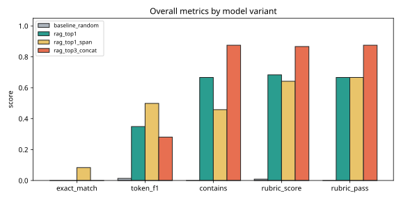
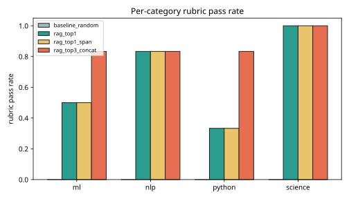
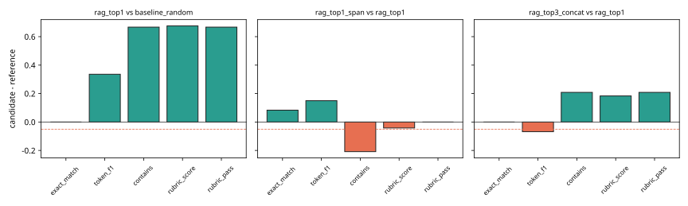

# Results -- ai-learn-10-eval-harness

**Seed:** `42` | eval items=24 | categories=4 | rubric pass threshold=0.7 | max allowed drop=0.05

## Overall metrics (real smoke run)

| Model | exact_match | token_f1 | contains | rubric_score | rubric_pass |
|---|---:|---:|---:|---:|---:|
| `baseline_random` | 0.0000 | 0.0134 | 0.0000 | 0.0083 | 0.0000 |
| `rag_top1` | 0.0000 | 0.3488 | 0.6667 | 0.6833 | 0.6667 |
| `rag_top1_span` | 0.0833 | 0.4985 | 0.4583 | 0.6417 | 0.6667 |
| `rag_top3_concat` | 0.0000 | 0.2806 | 0.8750 | 0.8667 | 0.8750 |

## Per-category rubric pass rate

| Model | ml | nlp | python | science |
|---|---:|---:|---:|---:|
| `baseline_random` | 0.000 | 0.000 | 0.000 | 0.000 |
| `rag_top1` | 0.500 | 0.833 | 0.333 | 1.000 |
| `rag_top1_span` | 0.500 | 0.833 | 0.333 | 1.000 |
| `rag_top3_concat` | 0.833 | 0.833 | 0.833 | 1.000 |

## Regression comparisons + release gate

Gate thresholds: `{'rubric_pass': 0.75, 'contains': 0.6}` and no drop larger than 0.05 on blocking metrics `['rubric_pass', 'contains']` (EM / token F1 / rubric_score are tracked, non-blocking).

| Candidate vs reference | Δ rubric_pass | Δ token_f1 | Δ EM | regressions | fail→pass | pass→fail | Gate |
|---|---:|---:|---:|---|---|---|:---:|
| rag_top1 vs baseline_random | +0.6667 | +0.3354 | +0.0000 | - | e01, e03, e08, e10, e11, e13, e14, e15, e16, e17, e19, e20, e21, e22, e23, e24 | - | FAIL |
| rag_top1_span vs rag_top1 | +0.0000 | +0.1497 | +0.0833 | overall.contains, ml.contains, nlp.contains, science.contains | - | - | FAIL |
| rag_top3_concat vs rag_top1 | +0.2083 | -0.0682 | +0.0000 | - | e02, e04, e05, e07, e09 | - | PASS |

**Best gated candidate:** `rag_top3_concat`

## Plots

## Sample predictions (`rag_top3_concat`)

| id | cat | prediction | F1 | rubric |
|---|---|---|---:|:---:|
| e01 | python | Python was created by Guido van Rossum. You create one with python -m  | 0.35 | Y |
| e02 | python | A Python list is an ordered mutable sequence. You add items to a list  | 0.25 | Y |
| e03 | python | Key lookup is fast because dictionaries use a hash table. Python dicti | 0.42 | Y |
| e04 | python | Virtual environments isolate package installs per project. You create  | 0.35 | Y |
| e05 | python | Tuples cannot be changed after creation. A tuple is an immutable order | 0.27 | Y |
| e06 | python | Python dictionaries map keys to values. Key lookup is fast because dic | 0.00 | N |
| e07 | ml | It reduces overfitting. Overfitting happens when a model memorizes tra | 0.57 | Y |
| e08 | ml | The learning rate controls the step size. Gradient descent updates par | 0.25 | Y |
| e09 | ml | K-fold cross-validation splits data into k folds. Each fold is used on | 0.12 | Y |
| e10 | ml | Regularization such as L2 weight decay penalizes large weights. It red | 0.29 | Y |

Wall time: 0.013s on CPU.
